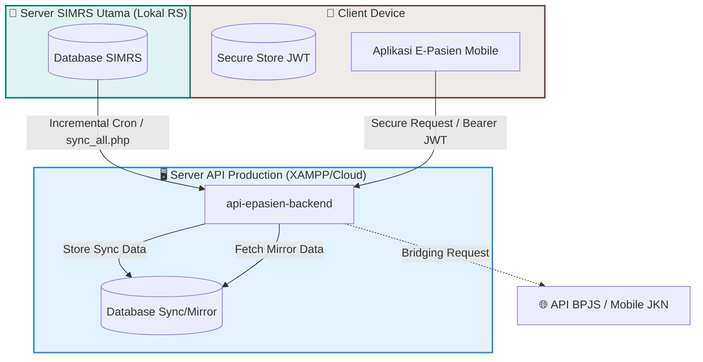

<div align="center">

  

  # 🏥 E-Pasien Mobile Standard 📱

  ### *Sistem Layanan Mandiri Pasien Terintegrasi SIMRS Rumah Sakit, Menghubungkan Pasien, BPJS Kesehatan, dan Diagnosis Cerdas.*

  <!-- Badges dari Shields.io yang disesuaikan dengan package.json asli -->
  [](https://expo.dev/)
  [](https://reactnative.dev/)
  [](https://www.typescriptlang.org/)
  [](https://github.com/)
  [](https://opensource.org/licenses/MIT)

</div>

---

## 📌 Daftar Isi
- [🌐 Tentang Sistem](#-tentang-sistem)
- [🏗️ Arsitektur & Sinkronisasi Sistem](#️-arsitektur--sinkronisasi-sistem)
- [🛡️ Standar Kepatuhan Keamanan (UU PDP)](#️-standar-kepatuhan-keamanan-uu-pdp)
- [📁 Peta Komponen Utama (Mobile & API)](#-peta-komponen-utama-mobile--api)
- [⚙️ Aturan & SOP Pemrograman (Coding Guidelines)](#️-aturan--sop-pemrograman-coding-guidelines)
- [🚀 Panduan Setup & Instalasi](#-panduan-setup--instalasi)
- [📊 Panduan Variabel Lingkungan (.env)](#-panduan-variabel-lingkungan-env)
- [🔔 Konfigurasi Push Notification (FCM)](#-konfigurasi-push-notification-firebase-cloud-messaging---fcm)
- [🤝 Kontribusi & Workflow Git](#-kontribusi--workflow-git)

---

## 🌐 Tentang Sistem

**E-Pasien Mobile Standard** adalah ekosistem layanan kesehatan digital terpadu yang dirancang untuk dapat diintegrasikan dengan berbagai sistem rumah sakit secara generik. Aplikasi mobile ini berinteraksi secara real-time dengan backend API **`api-epasien`** yang menjembatani database lokal **SIMRS** (Sistem Informasi Manajemen Rumah Sakit), layanan **Bridging BPJS Kesehatan (Mobile JKN)**, dan kecerdasan buatan (*AI Symptom Checker*).

---

## 🏗️ Arsitektur & Sinkronisasi Sistem

Sistem ini menerapkan pola arsitektur **Hybrid Decentralized Sync** untuk meminimalkan beban langsung pada server produksi SIMRS utama di rumah sakit.



### 🔄 Alur Sinkronisasi Data (SIMRS ➡️ Cloud API)
1. **Sinkronisasi Massal / Paksa (`sync_all.php?force=1`):** Digunakan untuk melakukan *dump* awal atau perbaikan struktur data master (dokter, poliklinik, penjamin) dari database SIMRS lokal ke server cloud.
2. **Sinkronisasi Inkremental (`sync_incremental.php`):** Script otomatis (*Cron Job*) yang berjalan di server lokal untuk memantau perubahan rekam medis terbaru (Hasil Lab, Radiologi, Resep, Kunjungan) dan mengirimkannya ke database cloud secara periodik.
3. **Orkestrator Khusus (`sync_lab_orchestrator.php`, `sync_resep_orchestrator.php`):** Menangani konflik data klinis dan memastikan file PDF atau citra medis telah diproses secara aman.

---

## 🛡️ Standar Kepatuhan Keamanan (UU PDP)

Sistem ini menerapkan standar kepatuhan **UU Pelindungan Data Pribadi (UU PDP 2022)** dengan sangat ketat untuk melindungi data sensitif pasien:

1. **Enkripsi Data Klinis:** Kolom medis sensitif pada data resume medis dienkripsi menggunakan metode kriptografi di sisi database sebelum ditransmisikan.
2. **Autentikasi Biometrik & Face Detector:** Registrasi akun pasien baru divalidasi menggunakan deteksi wajah di aplikasi (`expo-face-detector`) yang dikirim ke server (`validate_face.php`) untuk mencegah pemalsuan identitas pasien.
3. **Penyimpanan Kredensial Aman:** Token autentikasi JWT disimpan di perangkat keras aman perangkat menggunakan enkripsi hardware-backed `expo-secure-store`.
4. **Proxy Media Medis (`get_file_proxy.php`):** Hasil rontgen, radiologi, dan PDF lab **tidak pernah** diakses melalui tautan URL publik secara langsung. Seluruh akses media dijembatani oleh proxy PHP yang memeriksa keabsahan token JWT pengguna sebelum mengirimkan file.
5. **Manajemen Persetujuan (*Consent Management*):** Setiap kali data medis dibuka atau diakses oleh pihak keluarga (Fitur Family Account), sistem mewajibkan pengisian form tanda tangan elektronik (`react-native-signature-canvas`) yang tercatat dalam log audit melalui `submit_resume_consent.php`.

---

## 📁 Peta Komponen Utama (Mobile & API)

Berikut adalah pemetaan antara antarmuka aplikasi mobile (`mobile-epasien`) dan endpoint API backend pendukungnya (`api-epasien`):

| Fitur Mobile | Halaman Utama (`app/`) | Endpoint API Backend (`api-epasien/`) | Deskripsi Teknis |
| :--- | :--- | :--- | :--- |
| **Autentikasi** | `login.tsx`, `register.tsx` | `login.php`, `register.php`, `auth.php` | Sistem login berbasis JSON Web Token (JWT). |
| **Akun Keluarga** | `family_manage.tsx`, `family_add.tsx` | `get_family.php`, `add_family.php`, `delete_family.php` | Mengelola rekam medis keluarga terhubung dalam 1 akun. |
| **Booking Antrean** | `booking_antrian.tsx`, `queue_dashboard.tsx` | `submit_booking.php`, `get_dokter_by_poli.php`, `get_poliklinik.php` | Booking antrean dokter poliklinik terintegrasi antrean SIMRS. |
| **Bridging BPJS** | *Terintegrasi di Booking* | `bpjs_cek_peserta.php`, `bpjs_get_rujukan.php`, `bpjs_helper.php` | Validasi kepesertaan aktif dan penarikan surat rujukan FKTP. |
| **AI Symptom Checker**| `gejala_ai.tsx` | `ai_symptom_checker.php` | Diagnosis mandiri gejala awal bertenaga AI. |
| **Resume Medis** | `resume_medis_history.tsx` | `get_resume_medis.php`, `submit_resume_consent.php` | Riwayat rekam medis pasien dengan *Consent Management*. |
| **Hasil Lab** | `lab_history.tsx`, `lab_detail.tsx` | `get_lab_history.php`, `get_lab_detail.php`, `get_file_proxy.php` | Menampilkan detail hasil lab dan unduh PDF hasil ekspertise. |
| **Hasil Radiologi** | `radiologi_history.tsx` | `get_radiologi_history.php`, `get_radiologi_detail.php` | Riwayat bacaan rontgen/CT-Scan beserta citra medis. |
| **Pengingat Obat** | `medicine_reminder.tsx` | `get_reminders.php`, `save_reminder.php`, `delete_reminder.php` | Alarm pengingat minum obat lokal terjadwal. |
| **Layanan Pengaduan** | `(tabs)/pengaduan.tsx` | `send_pengaduan.php`, `get_pengaduan.php` | Pengaduan layanan langsung ke manajemen rumah sakit. |

---

## ⚙️ Aturan & SOP Pemrograman (Coding Guidelines)

Setiap pengembang yang berkontribusi pada repositori ini wajib mematuhi aturan penulisan kode berikut demi konsistensi dan skalabilitas:

### 1. Keamanan & Autentikasi
* **JANGAN PERNAH** menyimpan token JWT, kata sandi, atau data rekam medis pasien dalam `AsyncStorage` biasa. Gunakan `SecureStore` untuk seluruh kredensial sensitif.
* Seluruh request ke backend wajib melalui berkas Axios instansi di `services/api.js`. Berkas ini dilengkapi dengan *Auth Interceptor* otomatis yang menyematkan token *Bearer* di setiap *header request*.

### 2. Standardisasi Tipe Data (TypeScript)
* Hindari penggunaan tipe data `any`. Buat *interface* atau *type declaration* yang jelas untuk setiap respons API baru (seperti data Pasien, Dokter, Rujukan, dan Antrean).
* Struktur rute menggunakan Expo Router wajib menerapkan *typed routes* dengan mengaktifkan fitur `experiments.typedRoutes` di `app.json`.

### 3. Konsistensi UI & Tema Desain
* Seluruh warna antarmuka wajib mengambil nilai referensi dari token warna global di `constants/Colors.ts`.
* Jangan menuliskan warna heksadesimal mentah di dalam file StyleSheet komponen.
* Seluruh teks harus mendukung *Dark Mode* dengan membungkus teks menggunakan komponen dasar bertema dari `components/Themed.tsx`.

### 4. Penanganan Kesalahan (Error Handling)
* Setiap request API wajib diletakkan di dalam blok `try { ... } catch (error) { ... }`.
* Respons error kode `401 Unauthorized` wajib diintersepsi secara global di `services/api.js` untuk secara otomatis menghapus sesi lama yang tidak valid dari `SecureStore` dan mengarahkan pengguna kembali ke halaman Login.

---

## 🚀 Panduan Setup & Instalasi

### 📋 Prasyarat Sistem
* **Node.js** v20.x (LTS) atau versi terbaru.
* **Java Development Kit (JDK)** v17 (untuk kebutuhan build native Android lokal).
* Aplikasi **Expo Go** terinstal pada handphone pengujian Anda.
* Server Backend API **`api-epasien`** yang terinstal dan berjalan pada server lokal XAMPP atau cloud staging Anda.

### 🔧 Langkah Pengaturan

1. **Clone Repositori:**
   ```bash
   git clone https://github.com/username/mobile-epasien.git
   cd mobile-epasien
   ```

2. **Instalasi Paket Dependensi:**
   ```bash
   npm install
   ```

3. **Menjalankan Server Bundler (Development):**
   ```bash
   npx expo start
   ```
   * *Tip:* Jika terjadi konflik cache setelah instalasi package baru, jalankan dengan perintah: `npx expo start -c`

4. **Kompilasi & Build Aplikasi ke Android (APK/AAB):**
   * **Build untuk Pengujian (Preview APK):**
     ```powershell
     set EAS_NO_VCS=1 && eas build -p android --profile preview
     ```
   * **Build untuk Rilis Resmi (Play Store):**
     * Menggunakan CMD:
       ```cmd
       set EAS_NO_VCS=1 && npx eas build -p android --profile production
       ```
     * Menggunakan PowerShell:
       ```powershell
       $env:EAS_NO_VCS=1; npx eas build -p android --profile production
       ```

---

## 📊 Panduan Variabel Lingkungan (.env)

Buat berkas `.env` (atau `.env.local` agar tidak ter-push ke git) di root direktori proyek Anda:

```env
# URL Endpoint API Backend (Arahkan ke folder API di lokal/XAMPP Anda atau staging cloud)
EXPO_PUBLIC_API_URL=http://localhost/api-epasien/data

# Identitas Project ID dari Akun Expo Application Services (EAS) Anda (Ganti dengan Project ID Anda sendiri)
EXPO_PUBLIC_EAS_PROJECT_ID=
```

---

## 🔔 Konfigurasi Push Notification (Firebase Cloud Messaging - FCM)

Aplikasi ini menggunakan layanan **Expo Push Notifications** yang dihubungkan dengan **Google Firebase Cloud Messaging (FCM)** untuk mengirimkan pemberitahuan/notifikasi secara real-time ke perangkat Android pasien.

Agar push notification dapat bekerja, Anda **wajib** mengonfigurasi proyek Firebase dan menghubungkannya dengan akun Expo Anda. Berikut adalah langkah-langkah detailnya:

### 1. Buat Proyek Baru di Firebase
1. Buka [Firebase Console](https://console.firebase.google.com/).
2. Klik **Add Project** (Tambah Proyek), masukkan nama proyek (misalnya: `epasien-mobile-app`), lalu ikuti panduan hingga proyek berhasil dibuat.
3. Aktifkan Google Analytics jika diperlukan, lalu klik **Create Project**.

### 2. Registrasikan Aplikasi Android di Firebase
1. Pada dashboard proyek Firebase baru Anda, klik ikon **Android** untuk menambahkan aplikasi.
2. Isi formulir pendaftaran:
   - **Android Package Name:** Wajib disamakan dengan konfigurasi di berkas `app.json` (Default: `com.standard.epasien`).
   - **App Nickname (Opsional):** Misal `E-Pasien Mobile`.
   - **Debug signing certificate SHA-1 (Opsional):** Bisa dikosongkan untuk saat ini.
3. Klik **Register App**.

### 3. Unduh & Konfigurasi `google-services.json`
1. Unduh berkas **`google-services.json`** yang disediakan oleh Firebase.
2. Pindahkan berkas tersebut ke **root direktori** proyek `epasien-mobile-app` Anda.
3. Daftarkan file ini pada berkas `app.json` di dalam objek `"android"` agar terbaca saat proses build:
   ```json
   "android": {
     "package": "com.standard.epasien",
     "googleServicesFile": "./google-services.json"
     // ... konfigurasi lainnya
   }
   ```

### 4. Unduh Private Key Service Account Firebase
Expo memerlukan akses kunci privat (Service Account) Firebase Anda untuk meneruskan notifikasi dari server Expo ke server FCM Google.
1. Di Firebase Console, klik ikon ⚙️ (gerigi) di samping *Project Overview* lalu pilih **Project Settings**.
2. Pilih tab **Service Accounts** (Akun Layanan).
3. Klik tombol **Generate New Private Key** (Buat Kunci Privat Baru), lalu konfirmasi dengan mengklik **Generate Key**.
4. Berkas kunci berupa berkas `.json` (kredensial service account) akan otomatis terunduh ke komputer Anda. Simpan berkas ini dengan aman.

### 5. Hubungkan Kredensial FCM ke Expo (EAS)
Terdapat dua cara untuk mengunggah kredensial FCM Anda ke sistem Expo:

#### Cara A: Melalui EAS CLI (Terminal)
1. Buka terminal pada root direktori proyek `epasien-mobile-app`.
2. Jalankan perintah manajemen kredensial EAS:
   ```bash
   eas credentials
   ```
3. Pilih platform `Android` ➡️ Pilih build profile (misal `production` atau `preview`).
4. Pilih opsi **FCM V1 Service Account Key** atau **Google Service Account**.
5. Masukkan path lokasi berkas `.json` kunci privat Firebase yang telah Anda unduh pada **Langkah 4**.
6. EAS CLI akan otomatis mengunggah dan mengonfigurasi kredensial tersebut ke akun Expo Anda.

#### Cara B: Melalui Dashboard Expo.dev (Web)
1. Buka browser dan login ke akun [Expo Dashboard](https://expo.dev/).
2. Masuk ke halaman proyek Anda.
3. Di panel menu sebelah kiri, buka **Project Settings** ➡️ **Credentials** ➡️ **Android**.
4. Pilih profil build Anda (misal `production` atau `preview`).
5. Pada bagian **FCM V1 Credentials** (atau Service Account Key), klik **Add Credentials** dan unggah berkas `.json` kunci privat Firebase yang diunduh pada **Langkah 4**.

### 6. Verifikasi & Pengujian
1. Build ulang aplikasi menggunakan EAS Build untuk menerapkan konfigurasi FCM baru:
   ```bash
   eas build -p android --profile preview
   ```
2. Jalankan aplikasi pada perangkat Android fisik (Push Notification tidak didukung penuh pada emulator).
3. Token push perangkat akan digenerasi secara otomatis oleh fungsi `registerForPushNotificationsAsync()` di berkas `services/notification.ts` dan dikirimkan ke backend melalui endpoint `save_token.php`.
4. Anda dapat menguji pengiriman push notification langsung melalui [Expo Push Notification Tool](https://expo.dev/notifications) dengan memasukkan token push perangkat Anda.

---

## 🤝 Kontribusi & Workflow Git

Untuk menjaga kebersihan repositori utama, ikuti aturan alur kerja (*workflow*) berikut sebelum melakukan push atau pembuatan *Pull Request*:

### 1. Penamaan Branch
* **Fitur Baru:** `feature/nama-fitur` (Contoh: `feature/bridging-jkn`)
* **Perbaikan Bug:** `bugfix/deskripsi-bug` (Contoh: `bugfix/login-blank-ios`)
* **Dokumentasi:** `docs/ubah-readme` (Contoh: `docs/perbarui-setup-guide`)

### 2. Standar Commit Message (Conventional Commits)
Gunakan format terstruktur berikut untuk setiap riwayat commit Anda:
* `feat(booking):` Menambahkan tombol ubah nomor kartu BPJS digital.
* `fix(auth):` Memperbaiki masalah crash JWT Token expired di iOS.
* `docs(readme):` Memperbarui panduan instalasi dan setup lokal API.
* `style(profile):` Mengubah alignment gambar profil pasien agar lebih proporsional.

---

<div align="center">
  Dibuat secara profesional untuk <strong>E-Pasien Mobile Standard Open Source</strong>.<br>
  Lisensi MIT © 2026.
</div>
